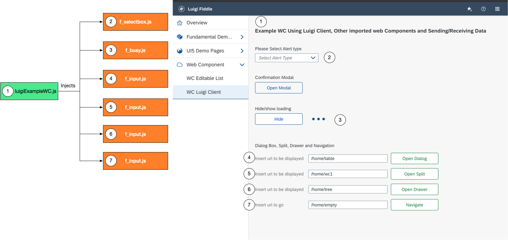
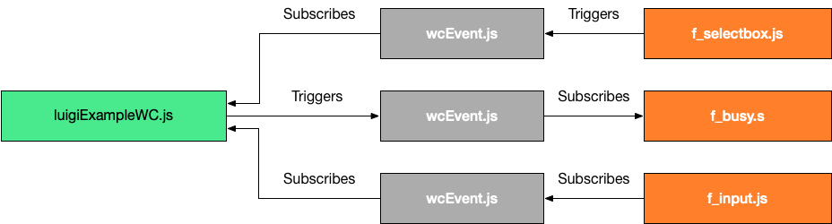

<!-- meta
{
  "node": {
    "label": "Web Component",
    "category": {
      "label": "Luigi Core"
    },
    "metaData": {
      "categoryPosition": 2,
      "position": 12
    }
  }
}
meta -->

# Web Component

<!-- add-attribute:class:success -->
>**TIP:** You can find some examples how to write/include web components in our test application [Luigi Fiddle](https://fiddle.luigi-project.io).

### Overview

Luigi offers the possibility to open a micro frontend as a web component; if you want to have more information about web component, please have a look at the page: [Web Component](https://developer.mozilla.org/en-US/docs/Web/Web_Components).

For no-complex micro frontend, it can be a good and fast alternative: all the frontend will be loaded in a single javascript file.

In this page you wil find:
-   [Navigation Configuration](#navigation-configuration) - how to configure web component in Luigi Core navigation
-   [Write a Web Component](#write-a-web-component) - quick description how to write a Web Component compatible with Luigi Framework
-   [Luigi Client for web component](#luigi-client-for-web-component) js object injected in that Web Component, to leverage some Luigi core features
-   [Tip: how to inject HTML Template code in web component](#tip-how-to-inject-html-template-code-in-web-component) - recommendation how to inject the html in a Web Component
-   [Tip: Loading a Web Component inside a Luigi WebComponent](#tip-loading-a-web-component-inside-a-luigi-webcomponent) - example how to include standard Web Components in your Luigi Web Component 
-   [Tip: Example of Luigi Web Component using other standard Web Component and how to communicate with them](#tip-example-of-luigi-web-component-using-other-standard-web-component-and-how-to-communicate-with-them)
    -   [File luigiExampleWC.js: the Luigi Web Compone](#file-luigiexamplewcjs-the-luigi-web-component) 
    -   [File f_selectbox.js](#file-f_selectboxjs)
    -   [File f_busy.js](#file-f_busyjs)
    -   [File f_input.js](#file-f_inputjs)
    -   [File wcEvent.js](#file-wceventjs)
        
            
## Navigation Configuration

If you want to declare a menu item to be open as Web Component, you need to specify this configuration in Luigi config:
```javascript
Luigi.setConfig({
    navigation: { 
   		// To enable CORS Web component Loading: basically you need to add external domains where the Web Components are hosted;
   		// in this examle, we are sepcify that we can load Web Components from everyhere
	    validWebcomponentUrls:['.*?'], 
	    nodes: [
		...
		{ 
		    pathSegment: 'wc', 
		    ………    
		    viewUrl: '/wc/luigiExampleWC.js',
		    webcomponent: true,
		    ………    
		}
		...
		]
	}
	.......
})
```

### Write a Web Component
Luigi supports Web Component that are slightly different from standard:
- You don’t need to declare any special tag definition inside the component like customElements.define(….., ….)
- Inside the component, Luigi core will inject an object in your class called LuigiClient

Here below, a very easy Hello World web component example:
```javascript
export default class ExampleWC extends HTMLElement {
  constructor() {
    super();
    const template = document.createElement('template');
    template.innerHTML = `<section><p>Hello World!</p></section>`;

    const templateBtn = document.createElement('template');
    templateBtn.innerHTML = '<button>Click me!</button>';

    this._shadowRoot = this.attachShadow({
      mode: 'open',
      delegatesFocus: false
    });
    this._shadowRoot.appendChild(template.content.cloneNode(true));
    this._shadowRoot.appendChild(templateBtn.content.cloneNode(true));

    this.$paragraph = this._shadowRoot.querySelector('p');
    this.$button = this._shadowRoot.querySelector('button');
    this.$button.addEventListener('click', () => {
      if (this.LuigiClient) {
        this.LuigiClient.uxManager().showAlert({
          text: 'Hello from uxManager in Web Component',
          type: 'info'
        });
      }
    });
  }

  set context(ctx) {
    this.$paragraph.innerHTML = ctx.title;
  }
}
```

As you could notice from previous example, you can use a LuigiClient instance inside your  web component class. 
It is really important to notice, that this LuigiClient instance is different from the one than you can find in [client library](https://docs.luigi-project.io/docs/luigi-client-setup).

Normal micro frontends are embedded inside iFrame: Luigi offers a library to allow the frontend to communicate with Luigi Core.
In Web Component the situation is quite different: they are not encapsulated into an iframe, they are just loaded inside a shadow element; 
when Luigi Core loads a Web Component, it injects a LuigiClient instance.

### Luigi Client for web component

In this javascript object, you can basically find two elements:
- `this.LuigiClient.uxManager()` : you can use all methods described in [Luigi Core UX](https://docs.luigi-project.io/docs/luigi-core-api?section=ux)
- `this.LuigiClient.linkManager()` : you can use all methods described in [Luigi Navigation](https://docs.luigi-project.io/docs/luigi-core-api?section=luiginavigation)

Below you have a a very easy Hello World web component example which shows an alert:
```javascript
export default class extends HTMLElement {
  constructor() {
    ........
    this.LuigiClient.uxManager().showAlert({
      text: 'Hello from uxManager in Web Component',
      type: 'info'
    });
    ........ 
  }
}
```

If you want to open a drawer:
```javascript
export default class extends HTMLElement {
  constructor() {
    ........
     this.LuigiClient.linkManager().openAsDrawer('Your Drawer Url', {header:true, backdrop:true, size:'s'});
    ........ 
  }
}
```


## Tip: how to inject HTML Template code in web component 

Sometimes your Web Component has some HTML template that you would like to use, instead of creating DOM elements one by one.
We suggest putting your HTML template inside a variable at the beginning of the js file and append to the web component root in the constructor. An example is given below:
```javascript
const template = document.createElement('template');
template.innerHTML = `
<!DOCTYPE html>
<html lang="EN">
<head>
    <meta charset="utf-8">
    <title></title>
    <link href="//unpkg.com/fundamental-styles@latest/dist/fundamental-styles.css" rel="stylesheet">
    <style>     </style>
    <script></script>
</head>
<body>
      ......
      <main class="fd-page">.....</main>
      ......
</body>
`;

export default class extends HTMLElement {
  constructor() {
     super();
     this.attachShadow({ mode: 'open' });
     this.shadowRoot.appendChild(template.content.cloneNode(true));
     ..........
  }
}
```
              

## Tip: Loading a Web Component inside a Luigi WebComponent
In order to modularize/reuse some code, you would like to import other standard Web Component inside Luigi Web Component. 
There could also be the case that you have already micro front end running in a standard Web Component and you would like to reuse it: 
the easier way is to create a Luigi Proxy Web Component, here below and example:

```javascript
//In Luigi Core Config you will have this new Item
{ 
    pathSegment: 'your-web-componet-through-proxy', 
    ………    
    viewUrl: '/wc/luigi_proxy_wc.js',
    webcomponent: true,
    ………    
}

```

```javascript
//This would be the file luigi_proxy_wc.js

const template = document.createElement('template');
template.innerHTML = `
  
  <your-web-component option1='xxx' option2='yyyyyy'/>
     
`;

import "./your_custom_wc.js";

export default class extends HTMLElement {
  constructor() {
     super();
     this.attachShadow({ mode: 'open' });
     this.shadowRoot.appendChild(template.content.cloneNode(true));
     ..........
  }
}
```

```javascript
//This would be the file your_custom_wc.js

(function() {
  class F_Input extends HTMLElement {
    constructor() {
      super();
      this.shadow = this.attachShadow({ mode: 'open' });
      .........
   }
  }
  
  customElements.define('your-web-component', F_Input);

})();
```


## Tip: Example of Luigi Web Component using other standard Web Component and how to communicate with them.

You can have a look at our Luigi Fiddle example where we showcase a Luigi Web Component that is using other custom standard web components and Luigi Client object [here](https://fiddle.luigi-project.io/#/home/wc2)
The following section gives a short description of all the files that are used.

You can see how the different Web Components are injected through the diagrams below:



The Components cannot use (read, write) other Components elements. For this reason, we created a new simple event mechanism example to allow communication between the different components:




### File luigiExampleWC.js: the Luigi Web Component
```javascript
import "./f_selectbox.js";
import "./f_busy.js";
import "./f_input.js";

const template = document.createElement('template');
template.innerHTML = `

<!DOCTYPE html>
<html lang="EN">
<head>
    <meta charset="utf-8">
    <title></title>
    <link href="//unpkg.com/fundamental-styles@latest/dist/fundamental-styles.css" rel="stylesheet">
    
    <style>
      .fd-page{
        padding: 20px;
      }
    </style>
    <script>
        function toggleElAttrs(id, toggleAttrs) {
            let ref = document.getElementById(id);
            if (ref && Array.isArray(toggleAttrs) && toggleAttrs.length){
                for(var i = 0; i < toggleAttrs.length; i++) {
                    var val = ref.getAttribute(toggleAttrs[i]);
                    if(val === 'true') {
                        setElAttr(id, toggleAttrs[i], 'false');
                    } else if (val === 'false') {
                        setElAttr(id, toggleAttrs[i], 'true');
                    }
                }
            }
       }
    </script>
</head>
<body>
      <main class="fd-page">
        <header>
            <div class="fd-container">
               <div class="fd-row">
                <div class="fd-col">
                  <div class="docs-layout-grid-bg docs-layout-grid-bg--color-1">
                    <h3>Example WC Using Luigi Client, Other imported web Components and Sending/Receiving Data</h3>
                  </div>
                </div>
              </div>
            </div>
        </header>
        
        <div class="fd-page__content" role="region" style="padding-top:20px;">
            <div class="fd-container">
              <div class="fd-row">
                <div class="fd-col">
                      <div>Please Select Alert type</div>
                      <div style="padding-top:5px;">
                        <div style="width: 200px;">
                          <fundamental-list-box id="alertBox" placeholder="Select Alert Type" default_option="" option1="info" option2="success" option3="warning" option4="error" />
                         </div>
                       </div>
                   </div>
                </div>
              </div>
          </div>
          <br />
          
          <div class="fd-page__content" role="region" style="padding-top:20px;">
            <div class="fd-container">
              <div class="fd-row">
                <div class="fd-col">
                      <div>Confirmation Modal</div>
                      <div style="padding-top:5px;">
                        <div style="width: 200px;">
                         <div class="fddocs-container">
                                <button class="fd-button fd-button--ghost" id="bConModal" style="width:150px;">Open Modal</button>
                            </div>
                        </div>
                      </div>
                </div>
              </div>
          </div>
          <br />
          
         <div class="fd-page__content" role="region" style="padding-top:20px;">
            <div class="fd-container">
              <div class="fd-row">
                <div class="fd-col">
                      <div>Hide/show loading</div>
                      <div style="padding-top:5px;">
                       <div class="fddocs-container" style="float: left;">
                            <button class="fd-button" id="bHideBusy" style="width: 150px;">Hide</button>
                            <button class="fd-button fd-button--emphasized" id="bShowBusy" style="width: 150px;">Show</button>
                        </div>
                        <div style="width: 100px;float: left;padding-top: 10px;">
                          <fundamental-busy id="busyIndicatorExample" show="false"/></div>
                        </div>
                        
                      </div>
                </div>
            </div>
          </div>
          <br />
        
       <div class="fd-page__content" role="region" style="padding-top:10px;">
            <div class="fd-container">
              <div class="fd-row">
                <div class="fd-col">
                      <div>Dialog Box, Split, Drawer and Navigation</div>
                      <div style="width:100%;float: left;">
                          <div style="padding-top:5px;">
                            <div style="float: left;padding-top: 10px;">
                              <fundamental-input id="dialogUrl" defaultValue="/home/table" 
                              label="Insert url to be displayed" width="250px" labelWidth="160px"/>
                            </div>
                            <div class="fddocs-container" style="float: left; padding-left:10px;padding-top: 8px;">
                                <button class="fd-button fd-button--positive" id="bOpenDialog" style="width:150px;">Open Dialog</button>
                            </div>
                          </div>
                      </div>
                      <div style="width:100%;float: left;">
                          <div style="padding-top:5px;">
                            <div style="float: left;padding-top: 10px;">
                              <fundamental-input id="splitUrl" defaultValue="/home/wc1" 
                              label="Insert url to be displayed" width="250px" labelWidth="160px"/>
                            </div>
                            <div class="fddocs-container" style="float: left; padding-left:10px;padding-top: 8px;">
                                <button class="fd-button fd-button--positive" id="bSplitDialog" style="width:150px;">Open Split</button>
                            </div>
                          </div>
                      </div>
                      <div style="width:100%;float: left;">
                          <div style="padding-top:5px;">
                            <div style="float: left;padding-top: 10px;">
                              <fundamental-input id="drawerUrl" defaultValue="/home/tree" 
                              label="Insert url to be displayed" width="250px" labelWidth="160px"/>
                            </div>
                            <div class="fddocs-container" style="float: left; padding-left:10px;padding-top: 8px;">
                                <button class="fd-button fd-button--positive" id="bDrawer" style="width:150px;">Open Drawer</button>
                            </div>
                          </div>
                      </div>
                      
                      <div style="width:100%;float: left;">
                          <div style="padding-top:5px;">
                            <div style="float: left;padding-top: 10px;">
                              <fundamental-input id="navigationUrl" defaultValue="/home/empty" 
                              label="Insert url to go" width="250px" labelWidth="160px"/>
                            </div>
                            <div class="fddocs-container" style="float: left; padding-left:10px;padding-top: 8px;">
                                <button class="fd-button fd-button--positive" id="bNavigation" style="width:150px;">Navigate</button>
                            </div>
                          </div>
                      </div>
                      
                </div>
              </div>
            </div>
            <br />
        </div>
        <footer>
          
        </footer>  
          
    
</body>
</html>

`;

import EcEvent from "./wcEvent.js";

export default class extends HTMLElement {
  constructor() {
    super();
    this.attachShadow({ mode: 'open' });
    this.shadowRoot.appendChild(template.content.cloneNode(true));
    this.addClickButtonBusy();
    this.addConfirmationModal();

    this.addClickNavButton('#bOpenDialog', 'dialogUrl', url =>{
      this.LuigiClient.linkManager().openAsModal(url, {title:'Example Dialog', size:'l'});
    });
    this.addClickNavButton('#bSplitDialog', 'splitUrl', url =>{
      this.LuigiClient.linkManager().openAsSplitView(url, {title:'Example Dialog', size:'40'});
    });
    this.addClickNavButton('#bNavigation', 'navigationUrl', url =>{
      Luigi.navigation().navigate(url);
    });
    this.addClickNavButton('#bDrawer', 'drawerUrl', url =>{
      this.LuigiClient.linkManager().openAsDrawer(url, {header:true, backdrop:true, size:'s'});
    });

    EcEvent.removeAllListeners();
    EcEvent.register("alertBox",  this.showAlert.bind(this));
    EcEvent.register("dialogUrl",  event => this.dialogUrl = event.detail);
    EcEvent.register("splitUrl",  event => this.splitUrl = event.detail);
    EcEvent.register("drawerUrl",  event => this.drawerUrl = event.detail);
    EcEvent.register("navigationUrl",  event => this.navigationUrl = event.detail);
  }

  addConfirmationModal(){
    const button = this.shadowRoot.querySelector('#bConModal');
    button.addEventListener('click', (event) => {
      this.LuigiClient.uxManager().showConfirmationModal({
        header: "Confirmation",
        body: "Are you sure you want to do this?",
        buttonConfirm: "Yes",
        buttonDismiss: "No"
      });
      event.stopPropagation();
    });
  }

  addClickNavButton(selector, valueToCheck, clickFn){
    const button = this.shadowRoot.querySelector(selector);
    button.addEventListener('click', (event) => {
      if (!this[valueToCheck] || this[valueToCheck].length === 0){
        this.LuigiClient.uxManager().showAlert({
          text: 'Please insert an ulr in the input element',
          type: 'error'
        });
        return;
      }

      clickFn(this[valueToCheck]);
      event.stopPropagation();
    }, false);
  }

  addClickButtonBusy(){
    this.bHideBusy = this.shadowRoot.querySelector('#bHideBusy');
    this.bShowBusy = this.shadowRoot.querySelector('#bShowBusy');
    this.bShowBusy.style.display = 'none';
    this.bHideBusy.addEventListener('click', (event) => {
      this.toggleBusy('busyIndicatorExample', false);
      event.stopPropagation();
    }, false);
    this.bShowBusy.addEventListener('click', (event) => {
      this.toggleBusy('busyIndicatorExample', true);
      event.stopPropagation();
    }, false);
  }

  showAlert(event){
    let alertType = event.detail;
    if (this.LuigiClient) {
      this.LuigiClient.uxManager().showAlert({
        text: 'Hello from uxManager in Web Component',
        type: alertType
      });
    }
    event.stopPropagation();
  }

  toggleBusy(id, show){
    EcEvent.fire(id, show);
    const showButtonStyle = show ? 'none' : 'block';
    const hideButtonStyle = show ? 'block' : 'none';

    this.bShowBusy.style.display = showButtonStyle;
    this.bHideBusy.style.display = hideButtonStyle;
    this.showBusy = show;
  }
}

import './f_selectbox.js';
```

In this file we have the following elements:
- HTML template of the components where we have basically 4 sections
- An injected `<fundamental-list-box>` web component
- An injected `<f_busy web component>`
- An injected `<fundamental-input>` used 4 times
- We created an example of an event handler (file wcEvent.js) that is going to be used for the web components communication.

### File f_selectbox.js
```javascript
import EcEvent from "./wcEvent.js";

'use strict';
(function() {
  class F_Selectbox extends HTMLElement {
    constructor() {
      super();
      this.shadow = this.attachShadow({ mode: 'open' });
      const style = document.createElement('div');
      style.innerHTML = `
      <link href="//unpkg.com/fundamental-styles@latest/dist/fundamental-styles.css" rel="stylesheet">
      <style>
        .fd-list--dropdown .fd-list__item.is-hover, .fd-list--dropdown .fd-list__item:hover {
             background: #d8e9f8;!important;
      }
      
      </style>
      `;

      this.shadow.appendChild(style);
      const container = document.createElement('div');
      const items = this.items;
      const defaultValue = this.defaultValue;
      const placeholder = this.placeholder;
      const id = this.id;

      container.innerHTML = `
                <div style="display:flex;flex-direction:column" class="f_selectBox" id="${id}">
                    <div class="fd-popover">
                      <div class="fd-popover__control" aria-controls="F4GcX34" aria-expanded="true" aria-haspopup="true" id="emi2qudh" onclick="">
                        <div class="fd-input-group fd-input-group--control">
                          <input type="text" class="fd-input fd-input--compact fd-input-group__input" id="compactCombobox" placeholder="${placeholder !== undefined ? placeholder : ''}">
                          <span class="fd-input-group__addon fd-input-group__addon--compact fd-input-group__addon--button">
                                        <button aria-controls="F4GcX34" aria-expanded="true" aria-haspopup="true"
                                            class="fd-input-group__button fd-button fd-button--compact fd-button--transparent fd-select__button">
                                            <i class="sap-icon--navigation-down-arrow"></i>
                                        </button>
                                    </span>
                        </div>
                      </div>
                      <div class="fd-popover__body fd-popover__body--no-arrow fd-popover__body--dropdown fd-popover__body--dropdown-fill" aria-hidden="true" id="F4GcX34">
                        <div class="fd-popover__wrapper">
                          <ul aria-label="fruit options" class="fd-list fd-list--dropdown fd-list--compact" role="listbox">
                            ${items.map(item => `
                                <li role="option" tabindex="0" class="fd-list__item">
                                  <span class="fd-list__title">${item}</span>
                                </li>
                              `).join('')}
                          </ul>
                        </div>
                      </div>
                    </div>
                  </div>
      `;

      container.style.display = "none";
      this.shadow.appendChild(container);
      this.container = container;

      let optionContainer = this.shadowRoot.querySelector('.f_selectBox .fd-popover__body');
      let openButton = this.shadowRoot.querySelector('.f_selectBox .fd-input-group__button');
      openButton.addEventListener('click', (event) => {
        optionContainer.setAttribute('aria-hidden','false');
        event.stopPropagation();
      }, false);

      let inputField = this.shadowRoot.querySelector('.f_selectBox .fd-input-group__input');
      let optionValues = this.shadowRoot.querySelectorAll('.f_selectBox .fd-list__item');
      optionValues.forEach(optionValue => {
        let value = optionValue.querySelector('span').innerHTML.trim();
        optionValue.addEventListener('click', (event) => {
          inputField.value = value;
          optionContainer.setAttribute('aria-hidden','true');
          event.stopPropagation();
          if (id !== undefined && id.trim().length > 0){
            EcEvent.fire(id, value);
          }
        }, false);

      });

      document.addEventListener('click', function(event) {
        optionContainer.setAttribute('aria-hidden','true');
      });

    }

    // fires after the element has been attached to the DOM
    connectedCallback() {
      setTimeout(() => this.container.style.display = "block", 200);
    }

    get placeholder() {
      return this.getAttribute('placeholder') || '';
    }

    get defaultValue() {
      return this.getAttribute('default_option') || '';
    }

    get items() {
      const items = [];
      [...this.attributes].forEach(attr => {
        if (attr.name.startsWith('option')) {
          items.push(attr.value);
        }
      });
      return items;
    }

  }

  customElements.define('fundamental-list-box', F_Selectbox);
})();
```

This Web component is called using this html syntax: 
```javascript
<fundamental-list-box id="alertBox" placeholder="Select Alert Type" default_option="" option1="info" option2="success" option3="warning" option4="error" />
```
Web component will create a [Fundamental Combobox]:(https://sap.github.io/fundamental-styles/?path=/docs/patterns-combobox-input--cozy-and-compact).
Every time there is a change, it will send an event to main Luigi Web Component (luigiExampleWC.js) using this API:
```javascript
cEvent.fire(id, value);
```

luigiExampleWC.js will receive the event and show an alert (the alert type is contained in the event):
```javascript
EcEvent.register("alertBox",  this.showAlert.bind(this));

showAlert(event){
let alertType = event.detail;
if (this.LuigiClient) {
  this.LuigiClient.uxManager().showAlert({
    text: 'Hello from uxManager in Web Component',
    type: alertType
  });
}
event.stopPropagation();
}
```

### File f_busy.js
In this Web Component, we are showing a simple [Fundamental Busy Indicator](https://sap.github.io/fundamental-styles/?path=/docs/components-busy-indicator--standard).

```javascript
import EcEvent from "./wcEvent.js";

'use strict';
(function() {
  class F_Busy extends HTMLElement {
    constructor() {
      super();
      this.shadow = this.attachShadow({ mode: 'open' });

      const style = document.createElement('div');
      style.innerHTML = `
      <link href="//unpkg.com/fundamental-styles@latest/dist/fundamental-styles.css" rel="stylesheet">
      <style>
        .fd-list--dropdown .fd-list__item.is-hover, .fd-list--dropdown .fd-list__item:hover {
             background: #d8e9f8;!important;
      }
      </style>
      `;
      this.shadow.appendChild(style);

      const container = document.createElement('div');
      const show = this.show;
      const id = this.id;

      container.innerHTML = `
        <div style="text-align: center" id="${id}">
          <div class="fd-busy-indicator fd-busy-indicator--m" aria-hidden="false" aria-label="Loading">
            <div class="fd-busy-indicator__circle"></div>
            <div class="fd-busy-indicator__circle"></div>
            <div class="fd-busy-indicator__circle"></div>
          </div><br /><br />
        </div>     
      `;

      if (!show){
        container.style.display = "none";
      }

      this.shadow.appendChild(container);
      EcEvent.register(id, event => {
        const show = event.detail;
        const display = show ? 'block' : 'none';
        container.style.display = display;
      });
    }

    get show() {
      const attrValue = (this.getAttribute('show') || 'false').toLowerCase();
      return attrValue === 'false' || attrValue === 'no';
    }
  }

  customElements.define('fundamental-busy', F_Busy);
})();
```


From main Luigi Web Component we are using this html tag: 

```javascript
<fundamental-busy id="busyIndicatorExample" show="true"/></div>
```

The most interesting point is that we will send a command from Luigi Web Component to hide/show the component in this way:
```javascript
    EcEvent.fire(id, show);
//Where id='busyIndicatorExample' and show=true|false
```

THe busy Web Component will receive the event and show/hide the Busy Indicator:
```javascript
 EcEvent.register(id, event => {
        const show = event.detail;
        const display = show ? 'block' : 'none';
        container.style.display = display;
      });
```

### File f_input.js
This Web Component is used to display a [Fundamental Input](https://sap.github.io/fundamental-styles/?path=/docs/components-forms-input--primary) with a label.
```javascript
import EcEvent from "./wcEvent.js";

'use strict';
(function() {
  class F_Input extends HTMLElement {
    constructor() {
      super();
      this.shadow = this.attachShadow({ mode: 'open' });

      const style = document.createElement('div');
      style.innerHTML = `
      <link href="//unpkg.com/fundamental-styles@latest/dist/fundamental-styles.css" rel="stylesheet">
      <style>
      
      </style>
      `;
      this.shadow.appendChild(style);
      const container = document.createElement('div');
      const label = this.label;
      const value = this.defaultValue;
      const placeholder = this.placeholder;
      const width = this.width;
      const labelWidth = this.labelWidth;

      const id = this.id;
      let labelWidthStyle = '';
      if (labelWidth.length > 0){
        labelWidthStyle = ' style="width:' + labelWidth+ ';"'
      }
      container.innerHTML = `
        
        <div class="fd-form-item fd-form-item--horizontal" id="${id}">
            ${label.length === 0 ? '' : '<label class="fd-form-label" for="input-08" '+ labelWidthStyle+ '>' + label+ '</label>'}
            <input class="fd-input fd-input--compact" type="text" id="input-08" 
              placeholder="${placeholder}" aria-label="Image label" 
              ${value.length === 0 ? '': "value='" + value + "'"} 
              ${width.length === 0 ? '': "style='width:" + width + ";'"} 
             >
        </div>

      `;

      this.shadow.appendChild(container);
      let inputElem = this.shadow.querySelector('input');
      inputElem.addEventListener('keyup', (event) => {
        EcEvent.fire(id, inputElem.value);
        event.stopPropagation();
      }, false);

      if (!!value && value.trim().length > 0){
        EcEvent.fire(id, inputElem.value);
      }
    }

    get label() {
      return this.getAttribute('label') || '';
    }

    get defaultValue() {
      return this.getAttribute('defaultValue') || '';
    }

    get placeholder() {
      return this.getAttribute('placeholder') || '';
    }

    get width() {
      return this.getAttribute('width') || '';
    }

    get labelWidth() {
      return this.getAttribute('labelWidth') || '';
    }
  }

  customElements.define('fundamental-input', F_Input);
})();
```

From main Luigi Web Component we are using 4 times this web component using these html tags: 

```javascript
<fundamental-input id="dialogUrl" defaultValue="/home/table"     label="Insert url to be displayed" width="250px" labelWidth="160px"/>
<fundamental-input id="splitUrl" defaultValue="/home/wc1"        label="Insert url to be displayed" width="250px" labelWidth="160px"/>
<fundamental-input id="drawerUrl" defaultValue="/home/tree"      label="Insert url to be displayed" width="250px" labelWidth="160px"/>
<fundamental-input id="navigationUrl" defaultValue="/home/empty" label="Insert url to go" width="250px" labelWidth="160px"/>
```

Every time there is a change on the input text, we will trigger the even from the component: 
```javascript
inputElem.addEventListener('keyup', (event) => {
  EcEvent.fire(id, inputElem.value);
  event.stopPropagation();
}, false);
```

Luigi Web Component will receive the event with the input text change and store it into a local variable.
```javascript
EcEvent.register("dialogUrl",  event => this.dialogUrl = event.detail);
EcEvent.register("splitUrl",  event => this.splitUrl = event.detail);
EcEvent.register("drawerUrl",  event => this.drawerUrl = event.detail);
EcEvent.register("navigationUrl",  event => this.navigationUrl = event.detail);
```

### File wcEvent.js
This file is just a js class used to send/recieve messages between the several Web Components:
```javascript
class EventWC {
  constructor() {
    this._bus = document.createElement('div');
    this.eventFunction = {};
  }

  register(eventType, callback) {
    this._bus.addEventListener(eventType, callback);
  }

  remove(eventType, callback) {
    this._bus.removeEventListener(eventType, callback);
  }

  remove(eventType) {
    this._bus.removeEventListener(eventType, () => {});
  }

  fire(eventType, detail = {}) {
    this._bus.dispatchEvent(new CustomEvent(eventType, { detail }));
  }

  removeAllListeners(){
    this._bus = document.createElement('div');
  }

}

var eventWC = new EventWC();
export default eventWC;

```
