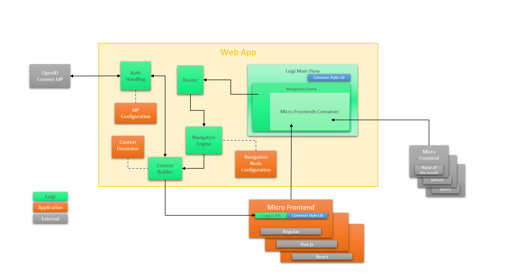

<!-- meta
{
  "node": {
    "label": "Architecture",
    "category": {
      "label": "Basics"
    },
    "metaData": {
      "categoryPosition": 1,
      "position": 1
    }
  }
}
meta -->

# Luigi Architecture

This diagram represents an overview of Luigi's architecture. It shows the relationship between the Luigi framework, the web application, and the external micro frontends and authorization providers:

