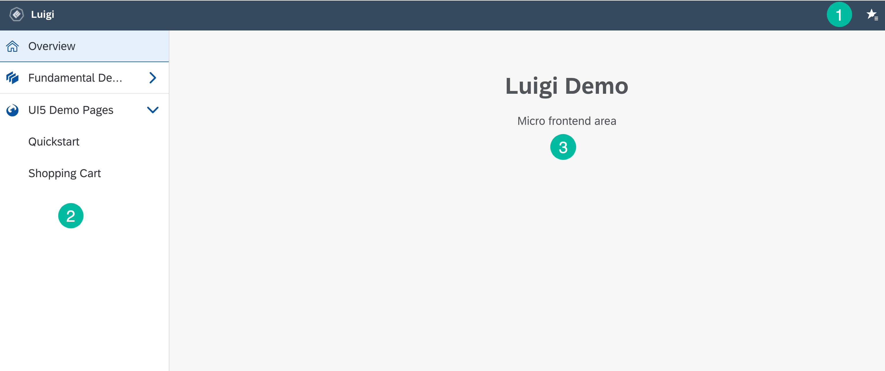

<!-- meta
{
  "node": {
    "label": "Basic navigation",
    "category": {
      "label": "Luigi Core"
    },
    "metaData": {
      "categoryPosition": 2,
      "position": 1
    }
  }
}
meta -->

#  Basic navigation configuration

This guide describes some basic features of Luigi navigation and how to configure it.

If you are already familiar with the basics, take a look at:
* [Advanced navigation configuration](navigation-advanced.md)
* [Full reference list of navigation parameters](navigation-parameters-reference.md)

## Navigation elements

There are three main elements to Luigi:

1. Top navigation which displays the main navigation path. Additionally, it can include context, product, app, and profile [switchers](navigation-advanced.md#context-switcher).

2. Side navigation which displays the child nodes of the root navigation node. It can include structures like collapsible dropdowns and categories which can be used for deep linking.

3. Main content window which renders the micro frontend.





## First steps

To configure navigation, edit the JavaScript configuration file of your project, specifically the `navigation:` category. See [application setup](application-setup.md) for instructions on where to find this file for your framework.

>**TIP:** You can use [Luigi Fiddle](https://fiddle.luigi-project.io) to experiment with configuration.

The configuration file contains a tree-like structure of **navigation nodes**. The first level nodes represent the top navigation, while their children represent the side navigation. The nodes have some basic properties, such as labels, links, views, and (optionally) children. These properties are called **navigation parameters**.

Here is an example of a simple navigation structure:

```javascript
navigation: {
  nodes: [
    {
      pathSegment: 'TopNav1',
      label: 'Top Navigation Element One',
      viewUrl: 'https://example.com',
      children: [
        {
          pathSegment: 'SideNav1',
          label: 'Side Navigation Element One',
          viewUrl: 'https://example.com/projects/list.html',
          children: [
            {
              link: '/TopNav1/internalLink',
              label: 'This takes you to [YOUR.WEBSITE]/TopNav1/internalLink',
            },
            {
              externalLink: {
                url: 'http://www.luigi-project.io',
                sameWindow: false
              },
              label: 'This takes you to an external page',
            },
          ]
        },
      ]
    },
    {
      pathSegment: 'TopNav2',
      label: 'Top Navigation Element Two',
      viewUrl: 'https://example.org',
      children: [
...
```

## Basic navigation parameters

<!-- add-attribute:class:warning -->
>**NOTE:** For a full list of available parameters, see the [parameter reference](navigation-parameters-reference.md) document.

The [first steps](#first-steps) example contains some basic navigation parameters:

### pathSegment
This is used to build the path in the browser URL. The main application path is built from values in the navigation path, joined with the **/** character. For example, if the value of a node's **pathSegment** is `home`, the path for that node would be `[YOUR.WEBSITE]/home`.  You can override this setting by using one of the following instead of **pathSegment**:
* **link** - define a specific internal path. Note that a valid path must always start from the **root node**. For example, if your root node is `home`, and you want to navigate to the `projects` directory:
	- `link: '/home/projects'` is correct
	- `link: '/projects'`is not correct, since `/projects` is not the root node
* **externalLink** - takes you to an external website. You must define the **url** of the website and whether it should be opened in a new window (`sameWindow: false`) or the same window (`sameWindow: true`).

You can also specify a nested node as `project/:id`. It can only be used standalone, with no other nodes having the same or partially overlapping pathSegments (eg. `projects` and `projects/:id` do not work together).

```
// structural node example
{
  viewUrl: '//example.com/projects/:id',
  pathSegment: `project/:id`,
  context: { id: ':id' }
}
// gets internally expanded to this node structure
{
  viewUrl: 'project',
  children: [{
    viewUrl: '//example.com/projects/:id',
    pathSegment: `:id`,
    context: { id: ':id' }
  }]
}
```

### label
The name of the node which will be visible on your page.
### viewUrl
The URL of the micro frontend which will be displayed in the main content area of your page.

## Grouping navigation nodes

You may use these parameters if you want to group related navigation nodes:

### category
You can add the **category** property to navigation nodes you want to group. The resulting structure will be different depending on whether you want to group top or side navigation nodes. In both cases, you should define at least one node in a group with **label** and **icon** properties. For all other nodes, you can set **category** as a string with the label value.

* Top navigation:
top navigation nodes in the same category will be rendered as a dropdown.
* Side navigation:
side navigation nodes will be grouped under a header with the category name. You can configure them to be **collapsible** or not.

This is an example of what a node with a category including a label and icon looks like:

```javascript
{
  category: { label: 'Links', icon: 'myIcon', collapsible: true },
  externalLink: {
    url: 'http://www.luigi-project.io',
    sameWindow: false
  },
  label: 'Click here to visit the Luigi homepage',
},
...
```

To define all subsequent nodes, use the category label:

```javascript
{
  category: Links,
  externalLink: {
    url: 'http://www.luigi-project.io',
    sameWindow: false
  },
  label: 'Click here to visit the Luigi homepage',
},
...
```
